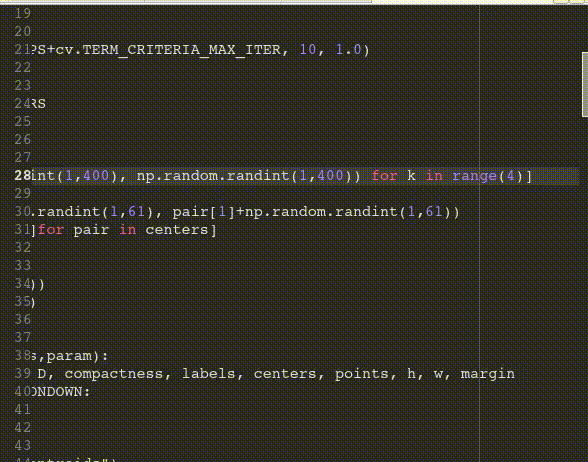

# K-Means Clustering
## What it does
It generates random data points (2-features) and classify them afterwards through k-means clustering algorithm.

## Where it comes from
This is an original approach to put into practice what it teaches here:
https://docs.opencv.org/master/d1/d5c/tutorial_py_kmeans_opencv.html

## Requirements
1. To have openCV python library properly installed.
3. Run the script.

## Instructions
* Left-Click over the plotted data to calculate the centroids and display them
* Click again to display the data grouped in colours.
* Click one more time to reset the random data and repeat the process.
* Press 'q' to exit the simulation.

