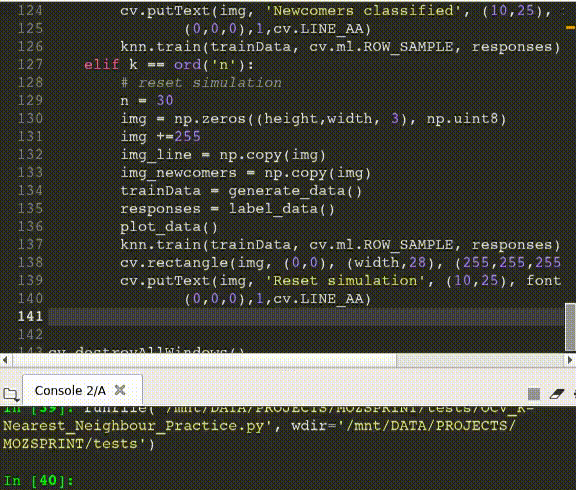

# KK Classifier Demo
## What it does
It classifies a generated line-shape newcomer objects in a 2-features set.

## Where it comes from
This is an original approach to put into practice what it teaches here:
https://docs.opencv.org/master/d5/d26/tutorial_py_knn_understanding.html

## Requirements
1. To have openCV python library properly installed.
3. Run the script.

## Instructions
* Left-click to set the origin of the basis line, left-click again to set the end point of the basis line. A green line will appear.
* Press 'c' key to generate a set of newcomers square objects over the basis line. The basis line will dissapear, 
and the objects will appear
* Press 'd' key to classify the set of newcomers. The new square objects will change of color based on the KNN algorithm.
* Follow the previous procedure as many times as you want.
* Press 'n' to reset the simulation.
* Press 'q' to exit the simulation.

